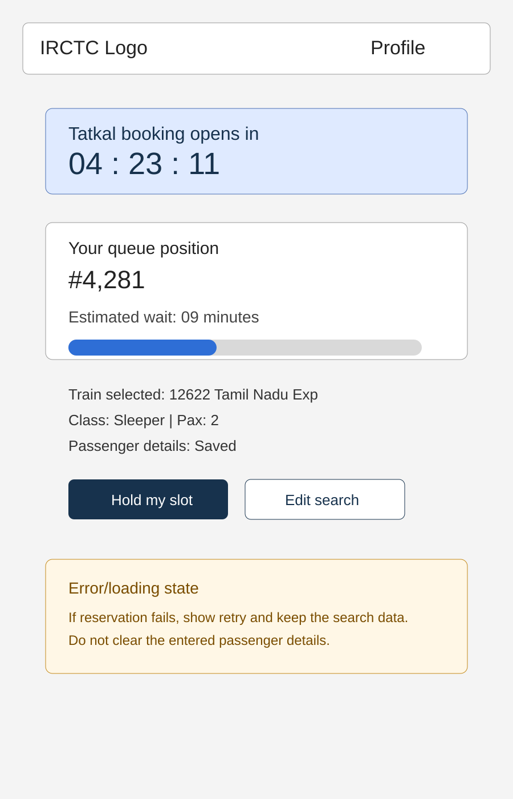
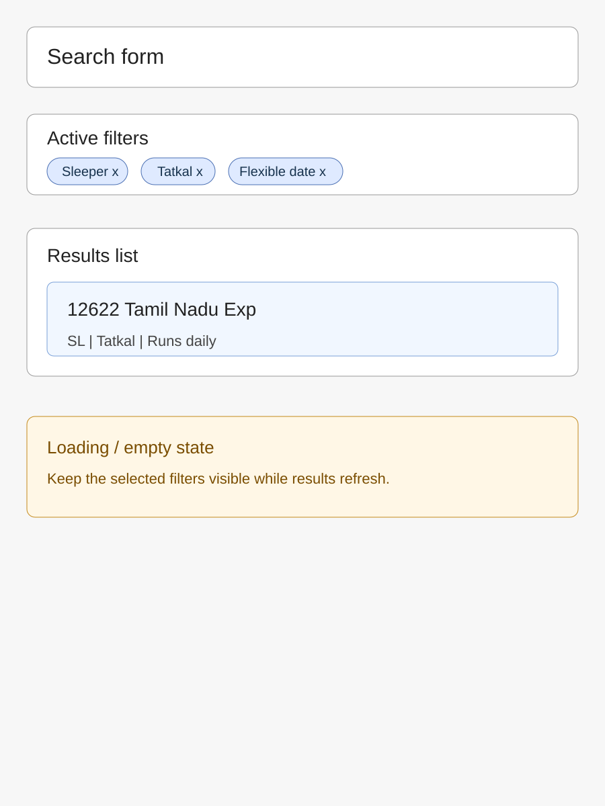
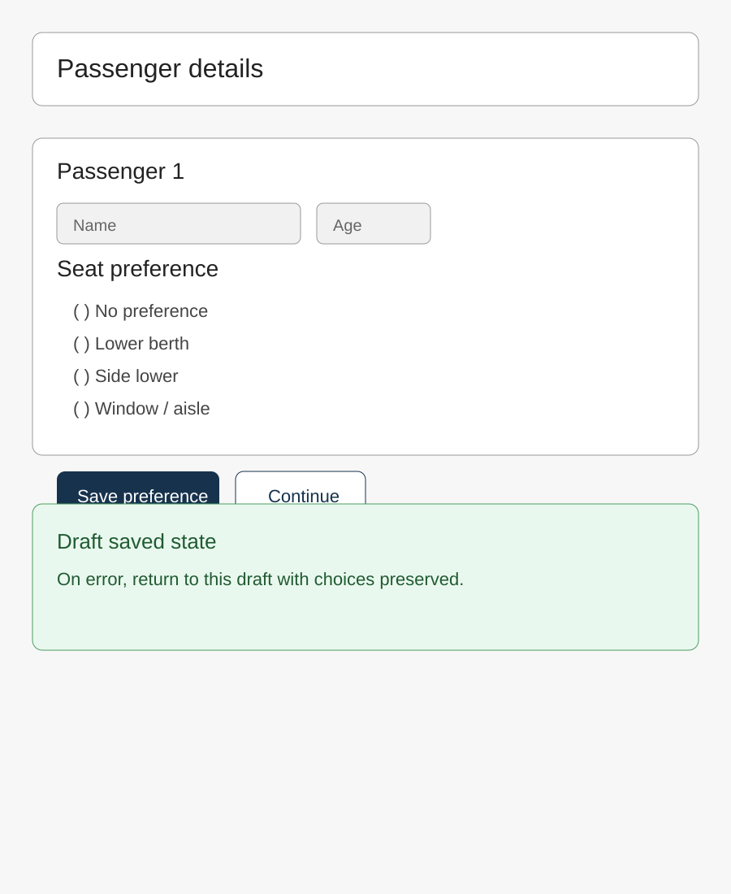
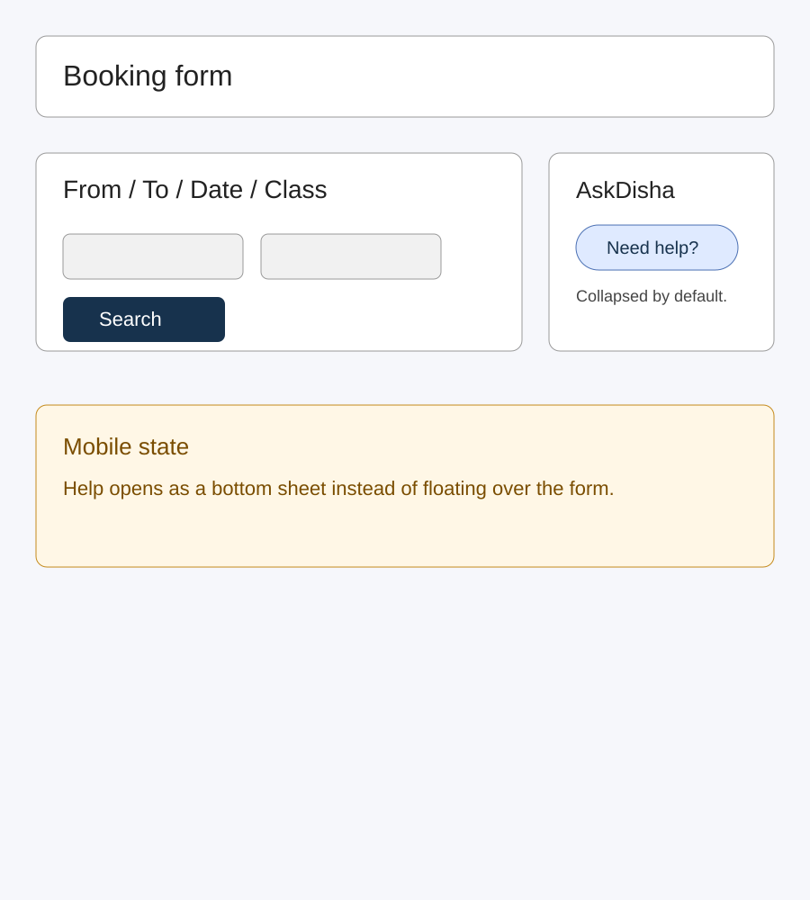
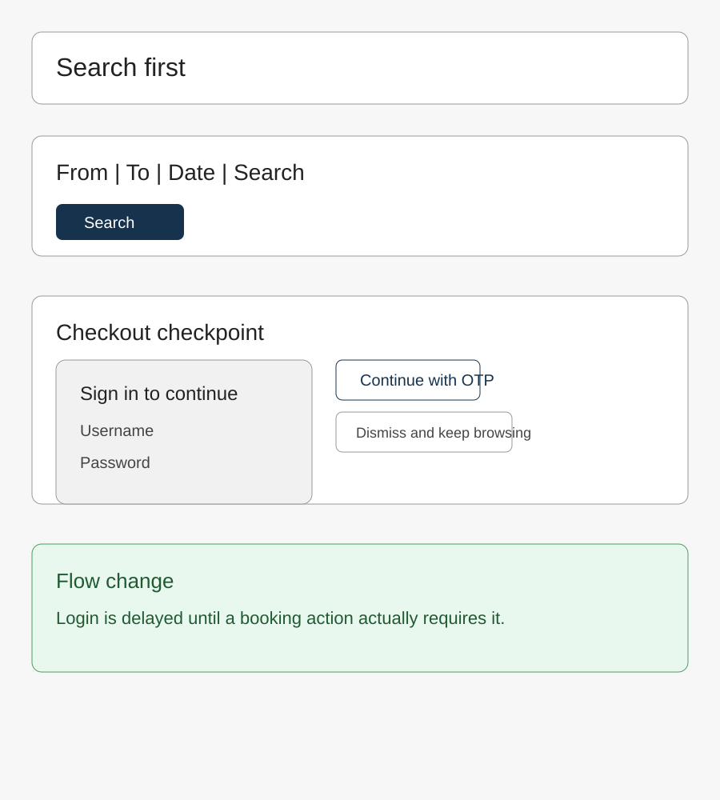
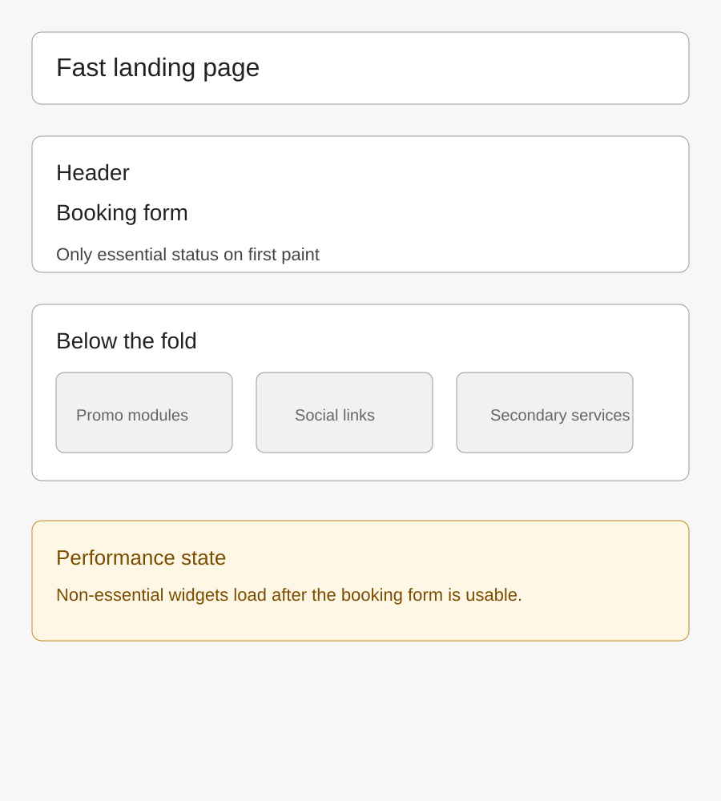

# Part B - Feature Specs

## Feature Spec 1: Tatkal Booking Crash Resilience

### Problem Statement
Part A, Problem 1 in [part-a/PROBLEMS.md](../part-a/PROBLEMS.md) documents the Tatkal booking crash at the moment demand spikes. This is a core-flow failure that affects the most time-sensitive users and causes missed bookings, retries, and lost trust.

### Current State (from Part A)
In Part A, the broken flow starts when the user enters route and date, switches to Tatkal, searches trains, selects a train, logs in, and then tries to continue into passenger and payment steps. The failure point is the unstable booking session under peak load, which causes timeouts or dropped transitions before the booking can complete.

### Proposed Solution
Give Tatkal users a protected booking slot with a visible queue position and a short confirmation window. The user should know whether they are waiting, when their turn is active, and how long they have before the slot expires.

### Proposed User Flow — Step by Step
1. User searches trains with Tatkal selected.
2. The system places them into a live queue and shows their position.
3. The queue panel shows an estimated wait and keeps the search context visible.
4. When the user reaches the front, the booking slot opens for 90 seconds.
5. User confirms passengers and moves directly to payment.
6. If the slot expires, the system preserves the entered data and returns the user to the queue or search screen.

### Wireframe

*Caption: Proposed Tatkal virtual queue screen with countdown, queue position, and failure state.*

### Technical Implementation Plan
**System components affected:**
- Booking search frontend
- Queue/reservation backend
- Redis or equivalent queue store
- Booking database for audit records
- Payment handoff flow

**New data requirements:**
- Queue position
- Reservation token
- Expiry timestamp
- User/session ID
- Train, class, quota, and passenger draft context

**API changes:**
- `POST /booking/reservations` creates or renews a Tatkal slot.
- `GET /booking/reservations/{id}` returns position, state, and expiry.
- `POST /booking/reservations/{id}/confirm` advances into the payment step if the slot is still valid.

**Frontend changes:**
- Add a queue status panel with live countdown state.
- Preserve search and passenger state while waiting.
- Add explicit waiting, active, expired, and error states.

**Third-party services (if any):**
- Redis for queue ordering and expiry

### Success Metrics
- Tatkal completion rate increases from the current peak-hour baseline.
- Reservation timeout errors decrease.
- Median time from search result selection to payment start stays consistent under load.

### Edge Cases and Constraints
- Reservation slots must expire cleanly when the user disappears.
- The queue must never promise availability, only a turn to attempt booking.
- If Railway inventory APIs fail, the UI must preserve state and show a clear retry path.

---

## Feature Spec 2: Search Filter Persistence

### Problem Statement
Part A, Problem 2 in [part-a/PROBLEMS.md](../part-a/PROBLEMS.md) shows that search filters do not reliably persist across repeated searches or navigation. This weakens trust in the search results and forces users to repeat the same filtering work.

### Current State (from Part A)
The broken flow begins when the user enters origin, destination, date, and optional filters like class, quota, or flexible date, then searches and compares result lists. The failure happens when those filters do not reappear consistently in the next search state or after back navigation.

### Proposed Solution
Keep the selected filters visible on the results screen and carry them forward across refreshes and repeated searches. The user should always be able to see what is active and remove or change a filter without rebuilding the search from scratch.

### Proposed User Flow — Step by Step
1. User fills in route, date, and optional filters.
2. User taps Search Trains.
3. Results screen loads with active filter chips visible.
4. User adjusts one filter and resubmits without losing the rest.
5. The system preserves the normalized filter state across back navigation and reloads.

### Wireframe

*Caption: Search results screen with persistent filter chips and loading state.*

### Technical Implementation Plan
**System components affected:**
- Search form frontend
- Results page frontend
- Search API
- Session/local storage state handling

**New data requirements:**
- Normalized filter object
- Recent search state
- Optional session-backed search preferences

**API changes:**
- `GET /trains/search` accepts filter parameters in the query string.
- `POST /trains/search` returns the normalized filter state with results.

**Frontend changes:**
- Introduce a shared filter state object between search and results views.
- Render chips for every active filter.
- Add clear-all and remove-one interactions.

**Third-party services (if any):**
- None

### Success Metrics
- Users repeat fewer searches per booking attempt.
- Filter retention after back navigation increases.
- Result-page abandonment decreases.

### Edge Cases and Constraints
- Invalid filter combinations should be normalized, not dropped silently.
- The feature should still work when JavaScript is limited or disabled.
- Query-string length must stay within browser and server limits.

---

## Feature Spec 3: Seat Preference State Preservation

### Problem Statement
Part A, Problem 3 in [part-a/PROBLEMS.md](../part-a/PROBLEMS.md) documents seat selection resetting during the booking wizard. This is especially harmful for families and accessibility-sensitive users because the selected berth preference is part of the booking intent.

### Current State (from Part A)
The broken flow occurs after the user reaches passenger details and chooses a berth or seat preference, but then changes another field or moves forward and back. The selected preference is not reliably restored, so the user has to re-enter it before continuing.

### Proposed Solution
Save booking state as a draft at each step so seat preferences are restored automatically if the user navigates around the flow. The user should see that the choice was saved and that it will survive validation errors or step changes.

### Proposed User Flow — Step by Step
1. User opens passenger details.
2. User chooses a seat or berth preference.
3. The system saves the selection into a draft booking.
4. User edits another field or navigates to the next step.
5. The preference remains selected when they return.
6. If validation fails, the draft reopens with all saved choices intact.

### Wireframe

*Caption: Passenger details screen with saved preference state and recovery message.*

### Technical Implementation Plan
**System components affected:**
- Booking wizard frontend
- Draft booking backend
- Booking database
- Validation flow

**New data requirements:**
- Draft booking ID
- Passenger list snapshot
- Seat/berth preference
- Current wizard step
- Draft expiry timestamp

**API changes:**
- `POST /booking/drafts` creates a booking draft.
- `PATCH /booking/drafts/{id}` updates partial step state.
- `GET /booking/drafts/{id}` restores saved draft data.

**Frontend changes:**
- Move form state into a draft-backed store.
- Show a saved-state indicator after each update.
- Restore seat preference automatically on reload or navigation.

**Third-party services (if any):**
- None

### Success Metrics
- Step-back correction rate decreases.
- Multi-passenger booking completion rate increases.
- Booking restarts after validation errors decrease.

### Edge Cases and Constraints
- Draft data must expire after a safe retention window.
- Saved state must not leak across accounts or shared devices.
- If the backend cannot honor the preference, the UI must explain the fallback clearly.

---

## Feature Spec 4: AskDisha Overlay Redesign

### Problem Statement
Part A, Problem 4 in [part-a/PROBLEMS.md](../part-a/PROBLEMS.md) shows the AskDisha widget competing with the booking surface. The issue is not the assistant itself, but the fact that it consumes the same visual area users need to start a booking.

### Current State (from Part A)
The broken flow is the first landing-page view, where the booking hero, controls, and assistant widget all appear at once. The failure point is the overlap and visual competition that makes the main search task harder to focus on.

### Proposed Solution
Turn AskDisha into a docked helper that starts collapsed and opens in a non-obstructive panel. On mobile, it should open as a bottom sheet instead of floating over the booking controls.

### Proposed User Flow — Step by Step
1. User lands on the booking page.
2. The booking form remains the primary visible element.
3. AskDisha appears as a small collapsed help chip.
4. User taps the chip only if help is needed.
5. The assistant opens in a side panel or bottom sheet that does not cover the form.

### Wireframe

*Caption: Booking page with collapsed AskDisha helper and mobile-safe bottom-sheet behavior.*

### Technical Implementation Plan
**System components affected:**
- Landing page frontend
- Chat launcher integration
- Support analytics events

**New data requirements:**
- Chat open/close events
- Assistant entry source

**API changes:**
- Optional telemetry endpoint for chat events

**Frontend changes:**
- Place the assistant in a reserved layout slot.
- Use breakpoint-specific behavior for desktop and mobile.
- Keep the launcher out of the booking form hit area.

**Third-party services (if any):**
- Existing chatbot provider remains in place

### Success Metrics
- Fewer landing-page dismissals caused by the assistant.
- More users reach the search form without closing overlays.
- Mobile overlap complaints decrease.

### Edge Cases and Constraints
- The assistant must remain reachable for support users.
- If the chat provider fails, the booking form should not be affected.
- The launcher must not cover core controls at common screen widths.

---

## Feature Spec 5: Deferred Login Flow

### Problem Statement
Part A, Problem 5 in [part-a/PROBLEMS.md](../part-a/PROBLEMS.md) documents a login modal interrupting the booking flow. This is costly because users are forced to authenticate before they have even committed to a booking decision.

### Current State (from Part A)
The broken flow starts when the user begins entering booking details and a login modal appears over the page. The failure point is the interruption itself, because the modal steals focus before the user has finished the primary search task.

### Proposed Solution
Let users search first and delay sign-in until the flow actually needs identity, such as saving a draft, entering passenger details, or paying. The booking journey should feel like one continuous task instead of a forced login detour.

### Proposed User Flow — Step by Step
1. User opens the booking page.
2. User searches trains without being interrupted by login.
3. User chooses a train and begins checkout.
4. The system requests sign-in only at the checkpoint where identity is required.
5. User logs in or uses OTP and continues with the saved booking draft.

### Wireframe

*Caption: Search-first flow with delayed login checkpoint at checkout.*

### Technical Implementation Plan
**System components affected:**
- Landing page frontend
- Authentication flow
- Draft booking backend
- Session management

**New data requirements:**
- Guest draft booking ID
- Auth intent flag
- Linked user ID after sign-in

**API changes:**
- `POST /auth/intent` triggers login only when needed.
- `POST /booking/drafts/{id}/attach-user` links a guest draft to an authenticated account.

**Frontend changes:**
- Remove auto-opening auth dialogs from the landing page.
- Trigger authentication at explicit funnel checkpoints only.
- Preserve draft state while the user signs in.

**Third-party services (if any):**
- Existing IRCTC OTP/auth flow

### Success Metrics
- Landing-page bounce rate decreases.
- Search-to-results conversion increases.
- Fewer sessions are abandoned before the first search completes.

### Edge Cases and Constraints
- Some payment or policy flows may still require immediate sign-in.
- Guest drafts must expire to prevent abuse.
- Logged-in users should not see an extra step unless the flow truly needs it.

---

## Feature Spec 6: Landing-Page Performance Hardening

### Problem Statement
Part A, Problem 6 in [part-a/PROBLEMS.md](../part-a/PROBLEMS.md) shows the homepage loading too many non-essential modules before the booking form becomes usable. That slows the user’s first meaningful action and makes the site feel heavier than it needs to be.

### Current State (from Part A)
The broken flow is the initial landing-page load, where the user must visually sift through promotions, assistants, and secondary services before focusing on the booking form. The failure point is not one single screen element; it is the cumulative cost of loading too much before the first booking interaction.

### Proposed Solution
Make the booking form the first thing that becomes usable, then defer everything else until after the user can already search. Non-essential widgets should load later and never block the main booking controls.

### Proposed User Flow — Step by Step
1. User opens the homepage.
2. The booking form and core header load first.
3. Secondary widgets, promos, and analytics are deferred.
4. User can begin searching without waiting for everything else.
5. Lower-priority modules load after the primary task is already available.

### Wireframe

*Caption: Fast-first landing page with deferred promotional modules and secondary content.*

### Technical Implementation Plan
**System components affected:**
- Landing page frontend
- Asset delivery pipeline
- Third-party script loading
- Performance monitoring

**New data requirements:**
- Performance budget thresholds for LCP, CLS, and script count
- Error and fallback logging for deferred widgets

**API changes:**
- None to booking logic; only rendering and asset delivery behavior changes

**Frontend changes:**
- Lazy-load promotional modules and assistant widgets.
- Keep the booking form at the top of the render priority.
- Defer non-essential scripts until after the first usable paint.

**Third-party services (if any):**
- Existing analytics and embedded widgets, but moved off the critical path

### Success Metrics
- Time to first meaningful booking interaction decreases.
- Mobile LCP improves.
- Users drop off less often before entering trip details.

### Edge Cases and Constraints
- Promotional modules still need to exist, but they cannot block booking.
- Third-party failures must not break the form.
- Performance gains should not reduce accessibility or error handling quality.

---

## Peer Review Follow-Up
The top two specs to review first are Tatkal Booking Crash Resilience and Deferred Login Flow, because they sit closest to the core booking funnel. After review, I would update the Tatkal spec with stricter expiry behavior, refine the Deferred Login metrics, and tighten the landing-page performance budget so the docs reflect the questions raised during critique.
